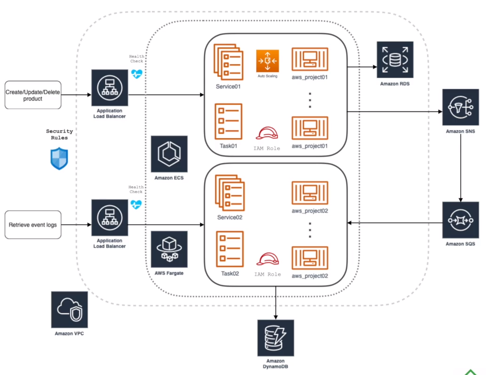

# curso_aws_cdk

## What does it do?
Receive events from aws_project01 project and persist in database...

## Responsibility
Persist events and provision product search.

## Development

#### Pre-requisites:
* IntelliJ
* Java 17
* Gradlew
* If you want to use [Docker](https://docs.docker.com/), install version 1.12 or greater: https://docs.docker.com/get-docker/

#### Service architecture


#### Running Local

#####
* Initialize aws_project01 

```bash
#### Environments your IDLE
$ `spring.profiles.active=local`
```
